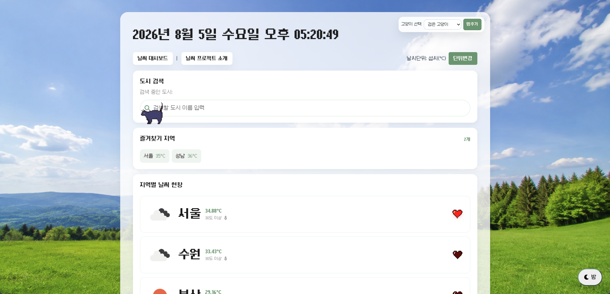
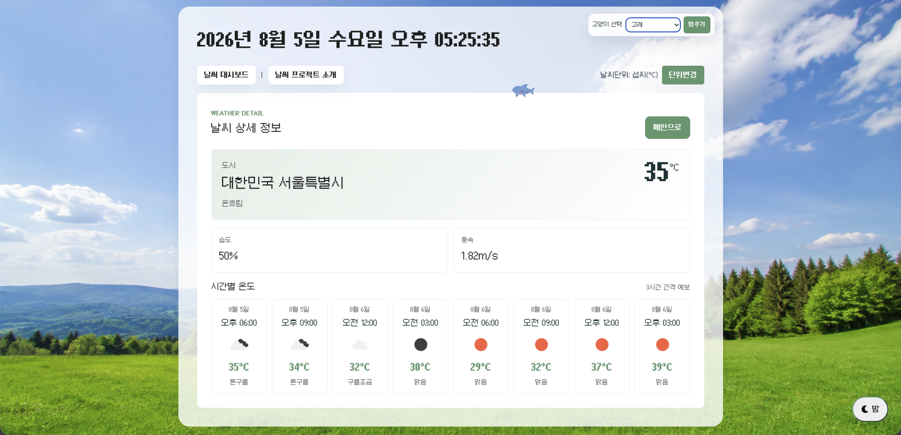

# Pixel Weather

Vue.js와 OpenWeatherMap API를 활용한 지역별 날씨 대시보드입니다.
서울, 수원, 부산, 성남, 대구, 제주 지역의 현재 날씨를 확인하고 상세 페이지에서 시간별 예보를 조회할 수 있습니다.




## 구현한 기능

- Axios를 활용한 OpenWeatherMap 현재 날씨 API 연동
- 서울, 수원, 부산, 성남, 대구, 제주 지역별 날씨 카드 표시
- 도시 검색 기능과 URL query string 연동
- 카드 클릭 시 상세 날씨 페이지 이동
- 상세 페이지에서 현재 온도, 날씨 상태, 습도, 풍속 표시
- OpenWeatherMap forecast API를 활용한 3시간 간격 시간별 온도 표시
- Pinia를 활용한 섭씨/화씨 단위 전역 상태 관리
- Pinia와 localStorage를 활용한 관심 지역 즐겨찾기 추가/해제 및 유지
- Element Plus Skeleton을 활용한 로딩 UI
- API 요청 실패와 환경변수 누락 상황에 대한 에러 처리
- 낮/밤 배경 테마 전환
- 움직이는 동물 선택, 멈춤, 숨김 기능
- 오늘 날짜와 현재 시간 실시간 표시
- Vue Router를 활용한 홈, 소개, 상세, 404 페이지 라우팅
- OpenWeatherMap API 키를 `.env` 환경변수로 분리
- Pixel 이미지 기반 favicon과 즐겨찾기 하트 UI 적용

## 실행 방법

### 1. 의존성 설치

```sh
npm install
```

### 2. 환경변수 설정

프로젝트 루트에 `.env` 파일을 만들고 OpenWeatherMap API 키를 입력합니다.

```env
VITE_OPENWEATHER_API_KEY=(발급받은 OpenWeatherMap API 키)
```

`.env` 파일은 `.gitignore`에 포함되어 Git에 올라가지 않습니다.

### 3. 개발 서버 실행

```sh
npm run dev
```

### 4. 프로덕션 빌드

```sh
npm run build
```

### 5. 린트 실행

```sh
npm run lint
```

## 4일간 어려웠던 점과 해결 과정

OpenWeatherMap에서 현재날씨의 최저온도(main.temp_min)와 최고온도(main.temp_max)가 현재온도와 같다고 응답이 왔습니다. 따라서, 더 찾아본 결과, 무료버전은 3시간마다의 정보를 제공해준다고 하여, 3시간 마다의 온도를 가져오
